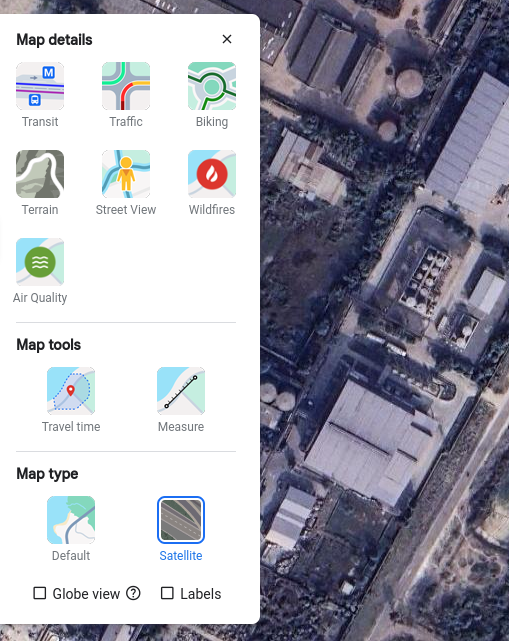

# rooftop-dataset-using-labelstudio
Dataset Generation for personal project by scraping google maps...google maps watermark visible

If on linux, install gnome-screenshot too.
Also, run the capture.py after being sudo user or change the permissions.

After deleting, modifying the images...run serialize.py

Before running capture.py, open the maps website on full screen and UNCHECK the labels ✅ option from bottom left > layers option

